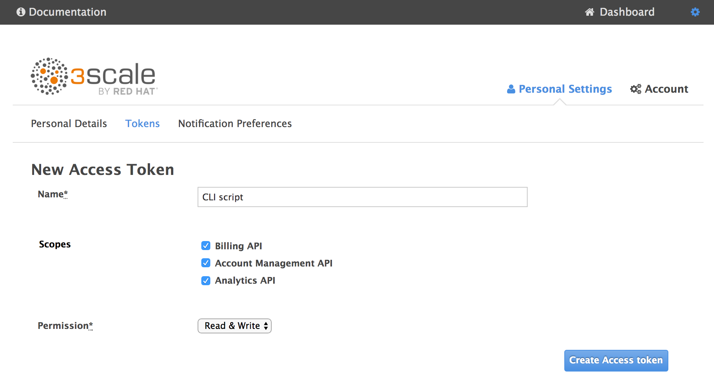
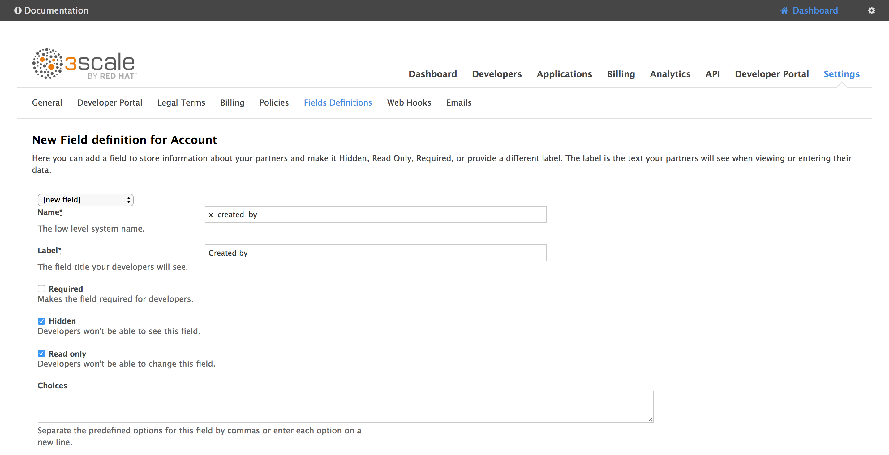
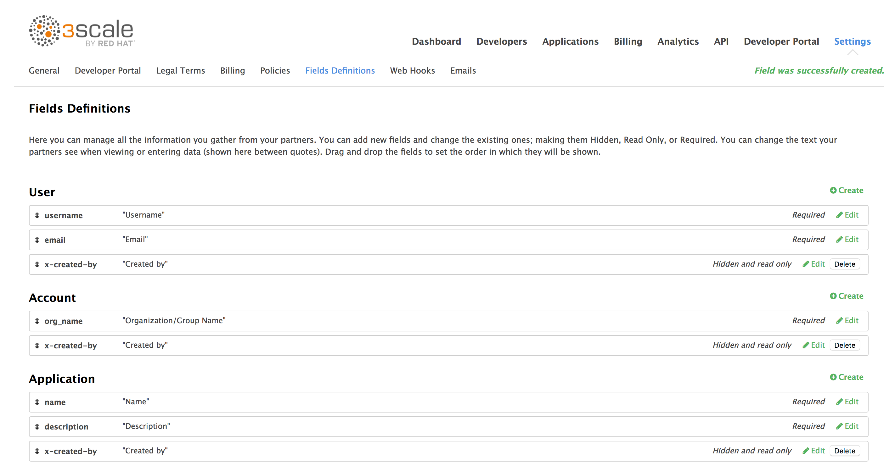

# A script that loads sample data in your 3scale account

## Why ?

Sometime to do a demo of 3scale, you would like to populate your account with sample data.  

## Overview

This scripts does two things :
 - create some sample data (accounts, applications, users) in your 3scale account.
 - cleanup your platform (ie. delete the previously created accounts, applications, users).

## Preparation

### Create an Access Token (MANDATORY)

Go to your 3scale admin console and click on the gear icon on the top right corner
and drill down to `Personal Settings` > `Tokens`.

Create an access token and keep the generated token in a safe place.
Make sure the "Account Management API" scope is checked and permissions is
set to "Read/write".



### Create an extra field (RECOMMENDED)

If you create an extra field named "x-created-by", the script will use it to mark
the accounts, applications and users so that it can do the cleanup later.

If this extra field is not created, the cleanup will not be done.

To create this field, go to your 3scale admin console and drill down to
`Settings` > `Fields Definition` and create three fields :
 - a user field named `x-created-by`
 - an account field named `x-created-by`
 - an application field named `x-created-by`

Make sure the name is `x-created-by` (the name is currently hardcoded) and :
 - `Hidden` is checked
 - `Read Only` is checked





## Installation

The easiest way to install this script is through NPM :
```
npm install -g 3scale-loader
```

## How to use it

To create 2 sample accounts, 3 applications in each account and 1 additional user in each account :
```
3scale-loader create --host <tenant>-admin.3scale.net --token <your-access-token> --accounts 2 --applications 3 --users 1 --verbose
```

To cleanup the created objects :
```
3scale-loader cleanup --host <tenant>-admin.3scale.net --token <your-access-token> --verbose
```

To get some help :
```
3scale-loader --help
```
